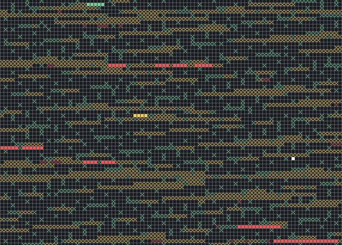

# Visualisation

Games of Corewar are usually visualised as a grid depicting the [Core](core) with each cell representing a memory address.  Addresses run in rows from left to right with successive rows running from top to bottom.  Note that because of the way relative addressing works in Corewar, the choice of which address is first is essentially arbitrary.  The core could just as easily be visualised as a ring of cells.

Initially, all addresses are loaded with a [dat](../redcode/opcodes#dat-data) instruction. These initially loaded addresses are represented by solid, grey cells. Next, each [warrior](warriors) is assigned a unique colour and its instructions are written to the core.

Each time a warrior executes an instruction in the core, the cell which represents the executed instruction is filled with the warrior's colour.  By executing instructions, a warrior can read from and write to addresses in the core.

When a warrior writes to core (i.e. modifies or replaces an instruction) the cell is filled with an X in the warrior's colour.

Likewise, when a warrior reads from an address in the core, a dot is placed in the cell using the warrior's colour.

To show which instruction is currently being executed, one cell within the visualisation will be filled with white.
